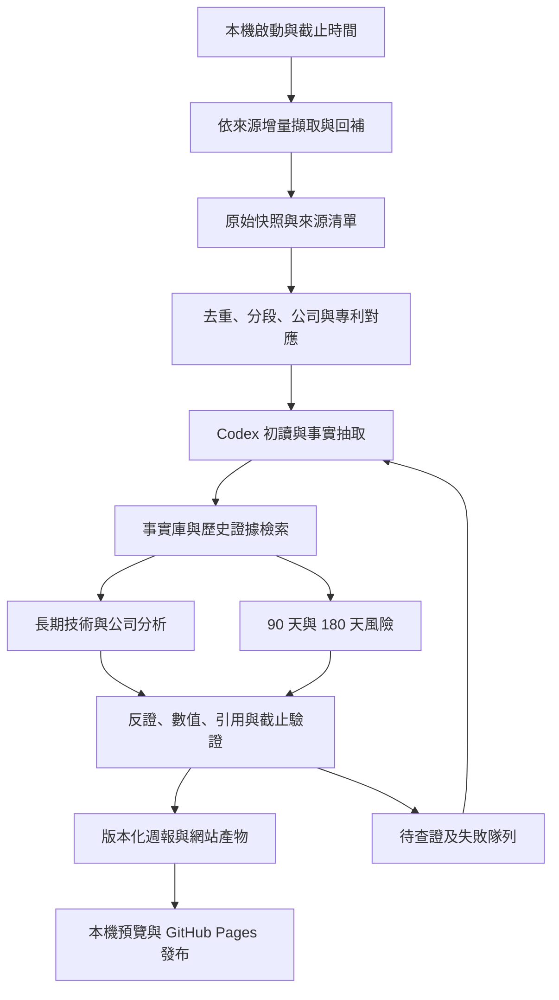

# EdgeFinance：以公開證據累積投資研究的專案規劃

> 本文件保留初始規劃及當時檢視紀錄。MVP 已實作，實際功能、驗證與限制以 [README](../README.md) 為準。
版本：v0.2｜日期：2026-09-14｜狀態：設計文件，尚未實作分析管線或網站。

## 1. 專案要交付什麼

建立一套可以連續使用十年的研究系統：每週在本機匯入公開資訊，使用已訂閱的 Codex CLI 理解新增內容，將資訊連結到技術、專利、產品、市場與公司，更新有證據、有反證、有期限的投資論點，最後輸出至 GitHub Pages。

系統需要回答五個問題：

1. 哪些技術正在跨過成本、效能、良率、供應鏈或法規門檻，可能在 3–10 年內形成大市場？
2. 哪些公司能從中取得營收、利潤及現金流？哪些原有公司可能被替代？
3. 公司是否能存活到技術成熟，且當前估值是否已反映甚至透支未來成功？
4. 與上週及歷史判斷相比，新資訊改變了什麼？還缺什麼證據？
5. 未來 90 天、180 天的主要國際金融風險，會如何傳導到產業與公司？

首頁呈現「截至本週仍成立的累積判斷」，每期週報保存「當時知道什麼、當時怎麼判斷」。研究排序用來安排查證與觀察，不直接等同買進指令或報酬承諾。

## 2. 把淘金比喻變成可執行流程

| 淘金步驟 | 系統工作 | 保存的成果 | 成功條件 |
|---|---|---|---|
| 勘查礦區 | 建立技術問題、CPC／IPC 分類、公司與產業清單 | 技術地圖、搜尋策略版本 | 找得到新技術，也留意失敗與替代方案 |
| 採集沙礫 | API、批次資料、RSS、合法網頁擷取 | 原始快照、取得時間、來源清單 | 可量測覆蓋與缺漏，能補抓 |
| 洗去泥沙 | 去重、解析、語言處理、公司辨識 | 標準化文件、事件、專利家族 | 同一事件被轉載不算多份獨立證據 |
| 分離候選金粒 | Codex 逐件初讀、分段抽取、時序偵測 | 可引用事實、候選訊號 | 每筆都有處理狀態與依據 |
| 驗金 | 原文核對、反證搜尋、財務與估值分析 | 版本化投資論點 | 能解釋何時成立及何時失效 |
| 保存與展示 | 靜態網站、週報、歷史回顧 | 機會地圖、風險頁、研究檔案 | 可返回當週證據，不事後改寫成績 |

最大的累積資產是「知道何時有哪些證據支持或否定某個論點」，以及已整理好的公司、產品和專利關係；下載量和文章長度只是過程指標。

## 3. 先修正四個關鍵假設

**最新公開專利與最新提出申請不同。** 美國多數適用公開制度的申請、以及歐洲專利申請，通常在最早相關申請／優先權日期後約 18 個月公開，並存在例外。資料庫必須同時記錄優先權日、申請日、公開日、核准日和實際取得日。以公開日及當時可取得的內容建立研究訊號，不能將後來公開的內容回填成早已知道。[USPTO 公開規則](https://www.uspto.gov/web/offices/pac/mpep/s1120.html)、[EPO 公開日期](https://register.epo.org/help?lng=en&topic=publicationdate)。

**專利不是產品路線圖的確定承諾。** 本專案把專利當作研發方向與技術主張的證據，將產品與上市時間寫成待驗證假說。申請人、現權利人、母公司、上市股票也可能不同。某項技術值得研究，並不代表其發明者或相關股票一定能獲利。

**港口活動與公司收入之間有多層映射。** UN Comtrade 的核心維度是國家、貿易夥伴、商品與期間；PortWatch 提供海運活動估計。公司級船舶艙單還可能隱匿名稱。貨櫃、重量、貨值、收入不能直接互換。[UN Comtrade](https://comtradeplus.un.org/TradeFlow?CommodityCodes=ALL)、[IMF PortWatch 研究](https://www.imf.org/en/-/media/files/publications/wp/2025/english/wpiea2025093-print-pdf.pdf)、[CBP 艙單保密說明](https://www.help.cbp.gov/s/article/Article-1108)。

**全球公開資料不是單一、完整、免費、可無限制再散布的資料庫。** 以公開資訊為主要來源，以分層取得、授權記錄及可量測的覆蓋率擴張。新聞索引命中不表示有全文授權；EPO OPS 也限制將原始資料直接公開散布。[EPO OPS 使用條件](https://www.epo.org/en/service-support/ordering/terms-and-conditions/ops-terms-and-conditions)。

## 4. 勘查哪些礦區

首版採「全球技術探索、可查證公司深研」：美國與 EPO 專利優先；公司財務先落實美國申報公司及可由 SEC 驗證的 ADR，台灣及歐洲當地上市公司隨接入財報來源擴展。EPO 覆蓋不等於歐盟各國所有國內專利；取得 US／EP 文件也不等於取得全球所有專利。

初始研究量暫定 3 個深研主題、30 家公司，搭配跨分類的探索隊列；用首輪實測後調整，不先承諾每週能深入理解全球所有文件。

下列是建議的**搜尋種子，並非本次得出的投資推薦**：

| 技術問題 | 可追蹤的技術方向 | 應檢查的成熟門檻 | 公司搜尋應涵蓋 |
|---|---|---|---|
| 運算與資料移動的能耗／頻寬限制 | 先進封裝、光互連、散熱與供電 | 每位元能耗、系統成本、良率、可靠性、客戶導入 | 設備、材料、零組件、系統商、客戶 |
| 電力供應與調度 | 儲能、電力電子、電網設備 | 全生命週期成本、壽命、接網、量產與訂單 | 製造商、營運商、關鍵材料、替代方案 |
| 自動化在真實環境中的可靠性 | 機器視覺、感測、致動與機器人 | 每次任務成本、介入率、維修、付費部署 | 零件、整機、軟體、實際使用者 |

探索策略不能只搜尋熱門名詞：

- 從「昂貴、耗能、短缺、產能不足、可靠性不足」等瓶頸出發，建立多語同義詞與 CPC／IPC 映射。
- 每週探索尚未列入觀察名單的新申請人、新分類組合、新研究團隊與競爭路徑。
- 初始把研究額度約 70% 放在既有論點，20% 放在新線索，10% 抽樣未入選文件；這是可調整的探索政策。
- 對低基期成長同時檢查絕對量，例如 1 件變 3 件不能只顯示成長 200%。
- 保存失敗、停產、專利放棄、客戶撤單和被收購個案，避免只研究事後成功者。

## 5. 資料取得的優先順序

來源詳見 [資料接入清單](DATA_SOURCES.zh-TW.md)。每個接入模組都需要來源識別、版本、更新頻率、取得方式、限流、授權與故障策略。

| 階段 | 先取得的資料 | 研究用途 |
|---|---|---|
| 核心閉環 | SEC 文件及財務、US／EP 專利樣本、公司 IR／政府 RSS、FRED／ALFRED | 把技術、公司、財務與風險串起來 |
| 增強訊號 | GDELT 新聞探索、OpenAlex／arXiv、UN Comtrade、PortWatch | 擴大探索、辨識研究聚落與實體經濟變化 |
| 擴充市場 | 台灣／歐洲官方財報、央行與統計、港務局、政府採購／補助／核准資料 | 增加當地公司及商業化證據 |
| 評估後加購 | 高品質公司級海關資料、完整全球專利整理、完整股價與公司行動歷史 | 補足已經證實影響研究品質的缺口 |

使用 API／官方批次檔優先於瀏覽器爬蟲。需登入的公開 API 以本機憑證取得；付費來源預設停用。來源無法取得時標記欠缺，不用未證實的替代數字填補。

初次歷史回補與每週增量分開：先回補重點主題的 5–10 年專利／研究軌跡及足夠的財務、景氣歷史，逐步擴張。歷史下載不搶占每週新資料的處理額度；舊聞的全文與原始版本可能無法完整找回，必須顯示缺口。

只在週末開機時，部分短期 RSS 已消失的內容無法保證回補。優先選可指定日期與分頁的 API，記錄可回溯窗口；未來可選擇每日只收資料、每週分析，仍保留每週手動執行模式。

## 6. 建立可追溯的時序證據庫

先用本機檔案加關聯式資料庫，不把每週資料塞進 Git 或單一試算表。

依使用者新增的 Atlas 設定，進一步採用 [儲存與發布決策](STORAGE_AND_PUBLISHING.zh-TW.md)：本機原始檔、正規化資料與版本化研究成果是權威來源；SQLite 是可重建的查詢索引與工作狀態；Atlas 可選作結構化查詢副本，未啟用或斷線時不阻斷週報。GitHub 保留程式及允許發布的精簡成果，完整 raw 另行備份。

| 層級 | 起始設計 | 保存什麼 |
|---|---|---|
| 原始層 | 本機壓縮檔、JSON／XML／HTML／PDF，依來源和日期分區 | 原始位元組、SHA-256、URL、回應狀態、取得條件 |
| 標準層 | SQLite 為主，批量時序以 Parquet 保存、DuckDB 查詢 | 文件、公司、專利、商品、事件、數列、時間與單位 |
| 研究層 | 結構化 JSON 與版本化資料表 | 抽取事實、計算特徵、論點、反證、預測、分析紀錄 |
| 公開層 | 經驗證的 JSON、Markdown、HTML、SVG／PNG | 自製分析與可公開數據、短引述、來源連結、圖表 |

這是設計選型；實作時再鎖定套件版本。標準化與研究成果另以 JSONL／JSON／Parquet 保存，避免只能從某一資料庫讀取。全文搜尋先使用 SQLite FTS；語意檢索有實測需求後再增加本機多語模型。初期不需要外部向量服務或獨立圖資料庫。

每筆文件至少保存：

- `source_id`、`document_id`、`source_record_id`、`canonical_url`、原始語言、標題。
- `event_time`：事件何時發生；`published_at`：何時正式公開；`first_seen_at`：系統何時首次看到。
- `fetched_at`、`source_updated_at`、`vintage_at`：何時取得及所屬資料修訂版本。
- `content_hash`、原文位置、解析器版本、解析品質、全文／摘要／索引等取得範圍。
- `rights_status`、`redistribution_policy`、公開層允許的欄位；不明時不公開原文。

每筆分析保存：輸入文件與分段清單、輸入雜湊、模型、CLI／提示詞／結構版本、研究截止時間、輸出、引用、驗證結果與耗用資訊。重跑可以使用相同輸入與規則，但不承諾語言模型輸出逐字一致；已發布結果必須保存。

核心資料表：`sources`、`fetch_runs`、`documents`、`document_versions`、`document_chunks`、`entities`、`entity_aliases`、`entity_relations`、`patents`、`patent_family_memberships`、`observations`、`claims`、`evidence_links`、`theses`、`thesis_versions`、`forecasts`、`analysis_jobs`、`reports`。

### 公司與股票的對應

以內部公司 ID 為中心，保留 CIK、LEI（可得時）、法律名稱、國家、曾用名、母子公司關係；證券另存交易所、股票代號、幣別、ADR／普通股及有效期間。股票代號不能作全球永久主鍵。

專利申請人／權利人 → 法律實體 → 當時母公司 → 對應證券，每一步都有證據與生效時間。模糊比對只是候選；同名、代理人、貨代、合資、併購和分拆須處理。無法確認時保留未匹配，不把模糊名稱硬接到股票。

### 專利的對應

唯一鍵包含管轄區、公開號與 kind code；申請、公開、授權與修正分開。保存原始文件及家族標準，固定以一套明確的家族定義計算趨勢，另留擴展家族關聯。同一家族的跨國申請不能當成數個獨立發明，但新增權利項或分案也不能全部忽略。

家族、引用、法律狀態與所有權的「當時版本」都要保存；不知道當時狀態，就不能拿今日版本聲稱完成嚴格歷史回測。

## 7. 讓 Codex 理解所有新資訊，但不失去品質

官方支援以 `codex exec` 執行非互動工作、使用 `--output-schema` 產生結構化結果、`--json` 保存事件，並沿用本機登入。本機已查得 `codex-cli 0.154.0-alpha.6.2`、`Logged in using ChatGPT`；本次未執行批次推論。[Codex 非互動文件](https://learn.chatgpt.com/docs/non-interactive-mode)、[登入方式](https://learn.chatgpt.com/docs/auth)。

預設沿用你的 ChatGPT 訂閱登入，模型可由專案設定指定並記錄實際使用版本。訂閱仍有使用限制，不把額度當無限；達限時存檔續跑，不自動購買額度、不偷偷切至付費 API。[官方額度說明](https://learn.chatgpt.com/docs/pricing)。

資料與排程在本機執行，Codex CLI 會將必要內容送往模型服務推論，並非模型完全離線運算。

建議分成六個可恢復的步驟，初期串行執行同一 CLI，不需要先建多代理系統：

| 步驟 | 交給 Codex 的內容 | 固定輸出 | 驗證方式 |
|---|---|---|---|
| 逐件初讀 | 每一筆新的唯一文件；長文件先按章節分段 | 技術、公司、事件、重要性、需深讀原因、可用內容範圍 | ID 完整、未漏件、無憑空補全文 |
| 事實抽取 | 可用全文、表格、專利摘要與權利項分段 | 事實、單位、日期、原文位置、來源主張、未知欄位 | 結構、引用位置與數值核對 |
| 跨文件整合 | 同主題新增內容、歷史關鍵證據、舊論點和反證 | 支持／衝突／重複關係，新舊差異 | 同源去重、時間截止檢查 |
| 長期與風險分析 | 經驗證事實及程式計算出的指標 | 技術／公司論點、90／180 天情境 | 因果鏈、替代解釋、估值及否證條件 |
| 挑戰與稽核 | 候選論點與其原始證據 | 不成立之處、缺資料、反例、降級建議 | 有疑點退回，不以重複模型同意取代驗證 |
| 編輯輸出 | 已驗證的論點與圖表資料 | 首頁更新、詳盡週報、公司／技術頁增量 | 引用、數字、狀態與頁面檢查 |

**「每筆處理」須有可核對的定義。** 依照你希望每份新資訊都被理解的要求，預設所有新增唯一文件先初讀，所有成功取得的全文再進入逐段事實抽取隊列；與研究有關的結果進入深入論點分析。全文太長就分段，每段都有已讀狀態；取得的只有摘要時只能標「摘要已讀」。可另設只對候選全文深讀的節省模式，但需明確切換並顯示覆蓋差異，不能將它說成全文已全部讀完。

對每期顯示取得、唯一、初讀完成、全文取得、深讀完成、待讀、失敗與未取得數量。初讀未完成時標記「部分完成」；全部工作完成後產生追加版本。吞吐不足則減少接入速率或延長處理，不丟棄待讀資料以製造完成率。

主題整合時取回歷史原始證據與反證，不能只將上一期摘要再摘要。無新資料時延續既有論點，標註最後支持日期；按論點期限定期檢視是否陳舊。

### 執行器需要具備的能力

- Python 控制抓取、分段、任務隊列、超時、退避、失敗重試及輸出驗證；來源限流與 CLI 額度各自管理。
- 分析任務鍵含內容雜湊、階段、提示詞與結構版本；成功結果快取，重啟只處理未完成任務。
- 保留事件 JSONL 和最終 JSON；退出碼成功且結構與引用驗證通過才標完成。
- 新聞／PDF／網頁視為不可信輸入，文內命令或提示不得變成操作指令。分析工作只看最小資料包，限制寫入及網路，停用無關工具／連接器；發布由固定程式進行。
- 子行程不繼承無關 API 金鑰與資料庫憑證；登入模式若不符合訂閱設定就回報並停止分析，不修改使用者全域設定。
- `null` 與「資料不足」是有效結果；不讓缺失資料變成零或高信心。

預計 CLI 呼叫形式如下。此為介面設計示意；`schemas`、資料包與輸出目錄將在實作階段建立，現在不可視為可運行命令：

```text
codex exec --sandbox read-only --output-schema schemas/document-analysis.schema.json --json -o work/result.json -
```

固定提示詞與資料包由執行器經 stdin 提供；不要把抓到的新聞文字串接成 shell 指令。實作時檢查當前 CLI 參數，並在隔離的研究工作目錄驗證實際權限。

## 8. 長期技術機會的分析方法

一份合格論點需串起這條證據鏈：

**重要問題 → 新技術能改善多少 → 從實驗走到量產的障礙 → 誰付錢 → 誰掌握價值 → 公司現金流 → 目前股價隱含的預期。**

技術進展的關鍵是可比較的量化門檻：每單位成本、效能／瓦、良率、壽命、部署數、客戶重複採購、量產資格與供應穩定性。實驗室最佳數據、廠商宣稱、第三方實測及商業部署分開標示。

專利候選指標包括新家族數、研發聚落變化、分類組合、跨團隊合作、權利項的技術問題、法律狀態、引用與競爭者活動。這些是**待驗證特徵**，不能直接宣稱能預測超額報酬。比較時按技術領域、公司規模、專利年齡與資料覆蓋校正；新專利尚無引用不代表差。

每個主題分別評估：

| 維度 | 必答問題 | 反證例 |
|---|---|---|
| 技術可行性 | 關鍵門檻是否被獨立驗證？ | 只在特殊實驗條件成立 |
| 商業成熟度 | 誰在付費、是否續購、何時量產？ | 試驗很多、付費客戶很少 |
| 價值取得 | 利潤可能落在哪個環節？ | 技術普及但供應商陷入價格競爭 |
| 公司承受力 | 現金、負債、資本支出、融資稀釋能否支撐？ | 量產前已需大幅增資 |
| 財務重要性 | 新業務在公司整體是否夠大？ | 有好技術但只占極小營收 |
| 估值與預期差 | 市價要求多大的營收、毛利與市占？ | 合理情境下仍無法支撐估值 |

先以分項 0–4 級、附理由與證據呈現，缺資料標未知；證據可信度獨立顯示。首版用透明規則安排研究優先級，不使用任意加權總分冒充獲利機率。累積實績後才評估分數是否有預測力。

3–10 年論點以里程碑範圍表達：技術驗證、試產、付費導入、量產、利潤擴張。每個區間都必須有條件與來源，不為十年後給出看似精準的單一價格。

財務模型由程式依假設計算：可服務市場 × 採用率 × 公司份額 → 收入；再加入毛利、營運費用、資本支出、營運資金、稅、淨負債與稀釋，形成股東價值情境。使用能適配行業的模型，並以反向估值檢查市價已要求什麼。所有輸入分成觀測、管理層指引與研究假設。

缺少可信股價、股本、淨負債或關鍵財務時，只列「值得研究的技術／公司」，不列為「估值具吸引力」。

## 9. 港口、貿易與公司營運訊號

建立分層映射：港口／航線 → 國家與 HS 商品 → 供應鏈 → 公司披露的地區與產品 → 營收及利润敏感度。

PortWatch／港務局資料用於發現區域或航線變化；Comtrade 用於商品與貿易方向；公司艙單只有在合法取得且名稱與业務匹配可信時使用。每一步保留映射來源與信心，未有公司級證據時結論停留於產業假說。

至少檢查：季節性、農曆年、基期、航線改道、罷工／塞港、空櫃／重櫃、重量／貨值、價格變化、存貨提前備貨、報關地與最終需求地差異、資料修訂。比較同比、移動平均及相對長期區間，不把單週跳升視為營收激增。

運價上漲可能源自需求或供給中斷，對航商、貨主、進口商的影響不同；還需看合約與即期比重、燃油、租船、運力、資產負債及股價已反映程度。驗證時預先定義「資料何時領先哪個已披露營運指標」，與簡單季節性模型比較。

## 10. 90／180 天國際金融風險引擎

分開輸出兩個期限的情境，允許 90 天風險升高但 180 天緩和。初版不假設使用者的部位或風險承受度，先呈現全球風險及觀察公司暴露；資產組合匯入是後續選配。

| 風險群 | 觀察項目 | 傳導到公司與資產的路徑 |
|---|---|---|
| 成長與需求 | 就業、工業、貿易、訂單與庫存 | 量、價格、固定成本吸收、信用損失 |
| 通膨與利率 | 通膨、能源、政策、殖利率與實質利率 | 成本、融資、折現率、消費力 |
| 信用與流動性 | 信用利差、融資壓力、到期債務 | 再融資、流動性、風險偏好 |
| 地緣與供應鏈 | 官方政策、制裁、關稅、航道與運輸 | 交期、出口限制、替代成本、區域收入 |
| 市場結構 | 估值、集中度、波動、相關性 | 擁擠交易、連鎖去槓桿、分散失效 |

每個風險卡提供：定義、期限、已知證據、發生條件、傳導鏈、受影響資產／公司、影響強度、資料可信度、可觀測觸發點、緩和條件與本週變化。

初版顯示「偏低／中／偏高＋依據」，不捏造 73% 等精準機率。只有事件定义、到期日、樣本和校準方式建立後才提供機率；若使用主觀情境權重，明確標示且合計 100%。

風險應對以條件式研究建議呈現，例如重新檢視高負債／單一航道暴露、延後評估某項論點、追蹤下一個指標；固定投資比例或個別避險交易必須等有使用者部位與限制才能個人化。壓力測試是情境計算，不能宣稱可預見所有突發事件。

週更有資訊截止點，網站一直顯示。若想在突發事件後即時反應，另開「事件補跑」指令；週報不能冒充即時警報。

## 11. 每週執行與故障恢復

預設週報區間按 Asia/Taipei 週一至週日，截止週日 23:59:59；內部時間統一保存 UTC 與來源時區。首次運行可指定歷史截止日，但不能因此把今日取得的修訂內容說成當時已見。

區分三個時間：`as_of` 是研究採用資料的公開截止點，`snapshot_frozen_at` 是本機完成取得並凍結資料包的時間，`decision_available_at` 是分析結果實際可用的時間。週一產生上週週報，可納入上週已公開且版本可確認的文件，同時如實保留週一的首次取得時間；模擬投資進場不得早於分析結果可用後的下一個可交易時點。截止後才公開的修訂不混入舊版本。



預計介面：`python -m edgefinance weekly --as-of YYYY-MM-DD`、`resume --run-id ...`、`backfill --source ...`、`validate --run-id ...`、`build-site --report ...`。這些命令尚未實作。

運行前檢查空間、來源設定、登入模式及週期鎖。每來源有獨立游標與已完成文件清單；只有頁面／分區提交成功才推進。對延遲公開和更正使用來源特定重疊回抓窗口，月季數列按發布日與修訂日取得，不能只查最近七個日曆日。

批次寫入使用交易；一筆錯誤不應阻斷所有來源。429／短暫故障依來源回應退避，授權失效停止該來源並顯示原因；重試有上限。報告狀態為 `draft`、`partial`、`validated`、`published`，避免爬蟲失敗而文章仍宣稱市場平靜。

先凍結資料快照，再產出報告。發布採完整版本產物及原子切換；驗證或部署失敗保留前一版首頁。週報修訂追加版本、列出更正原因，不覆蓋歷史判斷。每週備份原始資料、資料庫和分析結果，定期實際測試還原。

## 12. 網站產品

詳見 [首頁與週報規格](REPORT_AND_SITE_SPEC.zh-TW.md)。頁面包含首頁、技術、公司、專利家族、90／180 天風險、週報檔案、方法與資料覆蓋。

首頁先顯示當前機會、風險及本週判斷變化，再讓讀者展開完整研究。長期機會排序基於累積有效證據，不因一週沒有新聞就消失；已遭反證的論點移到降級／失效清單並保留原因。

GitHub Pages 適合輸出 HTML／CSS／JavaScript 的靜態網站。因此擷取、資料庫與 Codex 留在本機，GitHub 只建置／發布受控的公開產物。原始資料、登入憑證和資料庫不放公開站；圖表採預先計算的數據，避免依賴瀏覽器直接連接帶金鑰的 API。[GitHub Pages 說明](https://docs.github.com/en/pages/getting-started-with-github-pages/what-is-github-pages)。

前端首版建議採靜態生成框架配合少量互動圖表與本地搜尋。可選 Astro；實作前核對當時官方版本與 GitHub Pages base path 設定。架構不綁定這項工具，主要契約是已驗證的 JSON 與靜態輸出。

## 13. 如何證明研究有效

將「資料與抽取正確」和「投資判斷有效」分開驗收。模型寫得流暢不算有效。

| 層次 | 驗證內容 | 起始要求 |
|---|---|---|
| 取得 | 遺漏、重複、分頁截斷、修訂與時間 | 每來源有可核對清單，重跑不新增重複 |
| 實體 | 公司匹配、母子公司與專利家族 | 首批手工標記對照集；低把握不自動合併 |
| 抽取 | 引文是否存在且支持主張，數字／單位／否定詞 | 所有首頁核心主張覆核，隨機抽查其餘文件 |
| 分析 | 是否新資訊、反證、重複來源、期限 | 核心論點有支持、反對、未知及否證條件 |
| 研究結果 | 里程碑達成、預測校準、失效原因 | 保存每期版本與到期評估 |
| 投資結果 | 含股息、公司行動、退市、交易成本、匯率的報酬與回撤 | 與事先指定市場／產業基準比較 |

歷史測試只能使用當時已公開的資料版本、公司關係及專利引用；宏觀數列可優先利用 ALFRED 的歷史可得版本。[ALFRED 時間版本](https://fred.stlouisfed.org/docs/api/fred/realtime_period.html)。

特別注意：現代模型可能在訓練時看過歷史贏家，即使輸入只給舊資料，也不能保證沒有事後知識。歷史重播標示為方法探索，嚴格統計檢驗優先使用明確時點的數值特徵；從系統啟用日起凍結論點，持續前瞻觀察才是主要證據。

回測保留失敗、退市、併購公司，避免只挑 GPU 等已知贏家；訓練／調參／測試按時間分開。90／180 天標籤重疊時採不洩漏的時間分割與間隔處理；同事件與同專利家族不能跨組灌水。測試多個主題／門檻需保留嘗試紀錄，控制多重比較與過度調參。

與簡單基準比較：只用財報、只用專利數、只用新聞熱度、只用價格／產業因子，以及完整方法。只有新增資料能在樣本外改善結果，才值得擴大採集成本。

初期每週凍結研究觀察組合，寫明進出規則與下一個可交易時點，追蹤 1／3／6／12 個月及長期里程碑；不執行自動下單。十年論點需要更長時間驗證，不能用半年股價上漲證明十年技術判斷正確。

## 14. 容量、時間與費用

採集量與 Codex 深讀量分開估算。對所有來源先作小樣本，量測每種文件的大小、解析時間、模型輸入／輸出、重試率和人工稽核時間，再決定每週來源與公司數。

工作量示例（不是帳號額度預估）：500 份文件平均需要 3,000 輸入 tokens，單次抽取約 150 萬輸入 tokens；尚未計入輸出、長文件、歷史證據、複核與重試。由此不能直接推算某訂閱可完成多少文件或幾小時完成。

設定可調的每週執行時間、來源下載量、分析任務數及磁碟上限。保留 20% 的初始執行餘裕供失敗重試與新線索；實際比例用運行紀錄調整。未處理工作持續累積時，先減少新增範圍、提高去重及改善檢索，再評估額外成本。

儲存以實際資料量推算：例如每週 5 GB 的壓縮原始資料，一年約 260 GB，另需索引與備份。這是算術示例，非對全美歐專利資料量的估計；全文歷史回補可能大幅增加容量。EPO 官方列出的 EP 全文 backfile 已達 TB 等級，因此首版採重點回補。[EPO EP full-text data](https://www.epo.org/en/searching-for-patents/data/bulk-data-sets/data)。

不預設購買新資料或 API 服務。若資料欠缺，只在「能補足哪個具體研究缺口、成本與可替代性」可說明後列入選項。

## 15. 分階段實作與驗收

以下是單人迭代的相對順序與粗估，不是交付日期承諾。資料帳號、來源品質與每週可投入時間會影響進度。

| 階段 | 主要工作 | 驗收與進下一階段條件 |
|---|---|---|
| 0：基礎整理，約 1 週 | 處理既有憑證、環境設定、依賴、Git／忽略規則；來源登錄、共通 schema、時間與研究範圍 | 不需外部資料庫即可執行新管線；機密不進公開輸出；原始檔可核對 |
| 1：完整小閉環，約 1–2 週 | SEC、官方 RSS、FRED、US／EP 各一條可用專利取得路徑；少量文件經 Codex 出結構化週報及本機 HTML | 至少一個技術→專利→公司論點或明確不足結論；每項引用可查；中斷後續跑、兩次執行不重複 |
| 2：長期研究，約 2 週 | 專利家族、公司對應、3 主題與約 30 公司、分批歷史回補、技術里程碑、財務和估值 | 每個首頁候選至少兩類獨立來源，且有一項非專利商業／財務證據；缺估值者不得宣稱便宜 |
| 3：實體經濟與風險，約 1–2 週 | Comtrade／PortWatch、90／180 天風險、延遲與季節性處理、觀察組合 | 情境有期限與觸發點；產業與公司推論分層；有效處理修訂及來源故障 |
| 4：公開網站與運行校準，約 1 週 | 完整首頁／公司／技術／週報、圖表、搜尋、公開匯出、GitHub Pages | 手機與桌機正常；引用、數據、深連結與 base path 正確；失敗不覆蓋前版；完成連續週更演練 |
| 持續：擴張與驗證 | 台歐等當地市場、更多技術、來源貢獻評估、規則校準 | 依資料品質和研究增益擴張，不以來源數量作唯一 KPI |

只憑專利值得追蹤的想法可進「探索區」，但不能擠進證據完整的投資候選區。候選不足時允許首頁少於預定數量，不能為湊榜單降低證據標準。

## 16. 第一批工程任務

依此順序建立可拆分的工作項目，先把一次週報跑通：

1. 整理設定、憑證與依賴；保留舊資料和程式，不直接執行會寫入外部 MongoDB 的舊入口。
2. 定義來源、文件、公司、專利、引用、論點、報告的 schema 與版本策略。
3. 建立抓取器介面、來源清單、游標、原始快照與本機儲存。
4. 實作去重、日期、HTML／XML／PDF 解析品質、長文件分段與公司匹配候選。
5. 接通 SEC／RSS／FRED，加上 US／EP 專利小樣本；需帳號者取得帳號後驗證真實回應。
6. 建立 Codex 執行器、結構化抽取提示詞、快取、額度中止和續跑。
7. 用手工標記樣本檢查數字、公司歸屬、原文引用、翻譯、修訂與反證。
8. 實作論點版本、長期／風險分析與公開匯出規則。
9. 生成第一期含圖表與來源的靜態報告，檢查手機和桌機呈現。
10. 建立發布與還原；之後才擴大公司與資料量。

## 17. 目前程式的實際狀況

本次為只讀檢視與規劃，未執行舊爬蟲、未讀取既有 XLSX 內容、未連線 MongoDB、未啟用排程或發布網站。

- 根目錄目前不是 Git repository，沒有現有前端或專利分析管線。初次規劃新增 README 及三份文件；補充評估新增儲存與發布決策、Git 忽略規則及無真實值的 Atlas 設定範本。
- `News Scrapping/main.py` 依序呼叫多個新聞爬蟲。
- 檢視的 BBC／TechCrunch 模組每次最多取 10 筆，去重只在本次記憶體清單；不足以完成跨週累積與回補。
- `utils.py` 使用 `insert_many` 寫入 MongoDB，含硬編碼連線憑證。發布前改用本機環境設定並更換原憑證；是否曾公開或遭使用並未查證。
- 目前示例主要保存爬取時間、來源、內容、連結，缺公開時間、內容雜湊、修訂與證據定位；不能把舊爬取日期直接當新聞發布日。
- 檢視的 TechCrunch 模組在 import 時啟動瀏覽器；新設計改為執行時建立、結束時釋放。
- `requirements.txt` 列入標準庫 `time`，而 `utils.py` 使用的 `pymongo` 未列入。實作整理時再核對所有依賴與鎖版。

舊 Excel／MongoDB 資料可在後續遷移為帶來源的歷史輸入，缺失欄位保持未知，不生成假的公開時間或引用位置。舊原型目前整個資料夾由 `.gitignore` 排除，保留本機參考；新主流程以本機可恢復儲存為中心，MongoDB 作選配同步，依實際容量和需求啟用。

## 18. 第一版的完成定義

你在本機執行一次命令後，可以知道這週取得了什麼、漏了什麼、Codex 讀到什麼；打開網站能看到至少一份真實、有引用且可查證的週報，檢視長期機會與 90／180 天風險，並能回到過去任一週查看當時的判斷。

最重要的驗收是：**每個首頁論點都能一路追到當時的原始證據、計算與不確定性；每次判斷改變都有理由；每次失敗都不會讓歷史紀錄消失。**
