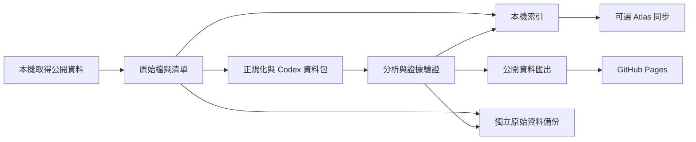

# 儲存與發布決策：本機、MongoDB Atlas 與 GitHub Pages

> 本文件保留初始規劃及當時檢視紀錄。MVP 已實作，實際功能、驗證與限制以 [README](../README.md) 為準。
日期：2026-09-14｜狀態：架構評估與設計，未連線 Atlas、未寫入資料庫、未發布網站。

本文件補充使用者新增的 `atlas-credentials.env` 與舊爬蟲定位。它細化 [完整專案規劃](PROJECT_PLAN.zh-TW.md) 的資料層；後續實作採用這裡的儲存分工。

## 1. 建議採用的方案

**本機保存原始資料與可重建的分析成果；本機索引支援每週研究；MongoDB Atlas 作可選的結構化查詢同步；GitHub Pages 展示公開分析及小型機器可讀資料。**

目前一個人、一台機器、每週執行的使用方式，以檔案為基礎最容易檢查、備份與續跑。有 Atlas 帳號並不要求第一版必須依賴遠端資料庫；先保留同步介面，確認叢集方案、容量和查詢需求後再啟用。

| 資料／工作 | 建議位置 | 原因 |
|---|---|---|
| 原始 HTML、XML、PDF、API 回應與附件 | 本機 `data/raw/`，另做獨立備份 | 保留原始證據，容量可控，可重新解析 |
| 正規化文件、時間序列、分析與論點版本 | 本機壓縮 JSONL／Parquet／JSON | 開放格式、易攜帶、可重建索引，模型可透過資料包閱讀 |
| 去重、任務狀態、全文查詢 | 本機 SQLite；大量時序按需用 DuckDB | 不依賴網路；可由檔案與執行清單重建 |
| 公司、專利關係、精簡證據、研究論點 | 可選 MongoDB Atlas 同步 | 跨機查詢、結構化篩選、後續服務整合 |
| 首頁、公司頁、技術頁、週報、圖表 | GitHub Pages | 週更結果是靜態產物，網站在本機關機後仍可瀏覽 |
| 程式、設定範本、方法與小型公開成果 | GitHub repository | 程式版本與研究發布紀錄 |
| 大量可再散布的公開研究資料集 | 後續評估獨立物件儲存／資料發布服務 | 用 manifest 與分片提供機器下載，不綁在網站 Git 歷史中 |

Atlas 是查詢副本，並不自動備份所有本機原始檔；原始資料必須另有備份。若未來要改為 Atlas 主資料庫，需要明確遷移決策，不讓本機與 Atlas 同時互相覆寫。

## 2. 幾個選項的比較

| 方案 | 初期成本與操作 | 長期累積 | 機器取得 | 適合本專案嗎？ |
|---|---|---|---|---|
| 全部小檔案提交 GitHub | 一開始容易；後來檔案與提交越來越多 | 原始資料、修訂和歷史使儲存庫成長 | clone／HTTP 容易起步，大量逐筆請求效率差 | 適合小型允許發布的樣本，完整原始資料不採用 |
| 全部存 MongoDB Atlas | 統一查詢，但需網路、叢集及儲存管理 | 容量、索引與方案限制；附件及完整歷史增加需求 | 透過本機／後端程式查詢，再輸出資料包 | 有可用場景，初版不把它設成所有工作的必要條件 |
| 本機檔案＋本機索引 | 最少雲端依賴，易於單機週更 | 需自行備份、管理磁碟 | 直接用程式批讀、產生 Codex 資料包 | **第一版預設** |
| 本機資料＋可選 Atlas＋靜態發布 | 稍多同步設計，各層職責清楚 | 可逐步擴展查詢及公開資料量 | 本機批讀、Atlas 查詢、公開 JSON 皆有 | **目標架構** |

對「最方便給機器取得」而言，穩定 ID、清單、schema、分片、版本與雜湊，比把資料全放進同一個平台更重要。

## 3. 每筆很小，累積起來仍然大

以下是假設每份純文字平均 20 KB 的算術示例，使用十進位 MB／GB；不是實測資料量，也未含壓縮、索引、附件、分析輸出、修訂和備份。

| 每週新增文件 | 每週原始文字 | 一年 52 週 | 十年 |
|---|---:|---:|---:|
| 1,000 | 20 MB | 1.04 GB | 10.4 GB |
| 10,000 | 200 MB | 10.4 GB | 104 GB |
| 100,000 | 2 GB | 104 GB | 1.04 TB |

因此，「小量公開精華放 GitHub」很合適；「為了完整全球資訊而長期把每份 raw 放 Git」不是同一個容量問題。即使壓縮可降低文字體積，修訂與 Git 歷史仍需管理，不能用壓縮率承諾資料量永遠不成問題。

GitHub 目前要求發布的 Pages 站點不大於 1 GB，流量軟上限為每月 100 GB。GitHub repository 也有檔案、目錄與整體規模建議；將 raw 移到另一個 branch 並不讓 Git 儲存量消失。[Pages 限制](https://docs.github.com/en/pages/getting-started-with-github-pages/github-pages-limits)、[Repository 限制](https://docs.github.com/en/repositories/creating-and-managing-repositories/repository-limits)。

## 4. MongoDB Atlas 應存什麼

先存需要查詢、需要關聯與會持續更新的結構化資料：

| Collection | 內容 | 建議穩定鍵／查詢索引 |
|---|---|---|
| `document_versions` | 文件 ID、版本、來源、公開時間、內容雜湊、原始檔 pointer、取得範圍 | 唯一 `document_id + version`；來源／公開時間 |
| `entities` | 公司法律名稱、別名、公司與證券識別碼 | 唯一內部 entity ID；識別碼與別名候選 |
| `entity_relations` | 母子公司、專利權利人、供應與採用關係及證據 | 關係 ID／版本；實體與有效時間 |
| `patent_families` | 家族標準、公開文件與申請人關係 | 家族 ID／版本；公司／分類／公開時間 |
| `claims`、`evidence_links` | 已抽取的精簡事實、引用定位、支持與反對關係 | 事實 ID；實體／主題／資訊時間 |
| `thesis_versions` | 版本化論點、里程碑、反證、狀態與估值摘要 | 唯一 thesis ID／版本；主題／有效狀態 |
| `report_versions` | 每期報告清單、公開成果連結與雜湊 | report ID／版本 |
| `sync_runs` | 同步批次、游標、成功與失敗 | 同步 run ID |

這是起始設計，不會一開始為每個欄位建索引。只為實際查詢增加索引，定期量測資料與索引大小。

完整新聞正文、PDF、圖片、所有長文件分段、重複內容和模型事件紀錄預設留本機。若某個查詢需要短摘要或少量正文，可在容量評估後加到 Atlas；大型原始內容使用指標連回檔案儲存，不無限制塞進單份文件或陣列。

MongoDB 官方目前列出 Free cluster 為 **512 MB（資料＋索引）**，Flex 為 5 GB；Free 沒有內建雲端備份。使用者目前的實際方案、剩餘空間、網路規則與可用權限尚未查證，不能因為有 URI 就判斷足以容納長期 raw。[Atlas 方案比較](https://www.mongodb.com/docs/atlas/manage-clusters/)、[Free cluster 限制](https://www.mongodb.com/docs/atlas/reference/free-shared-limitations/)。

若使用 Free：先同步精選的公司、論點、報告與必要證據；達到預先設定的容量門檻就停止擴大同步並回報，不刪除本機歷史，也不自動升級方案。全域 metadata 的量也可能很大，因此「只存索引」仍須測量。

## 5. 本機資料格式與機器讀取方式

所有以下路徑與格式是預計介面，尚未產生實際研究資料。

```text
data/
  raw/{source}/{year}/{month}/           原始回應／附件，保留 byte hash
  normalized/{source}/{year}/{week}/    documents-0001.jsonl.gz 等分片
  timeseries/{dataset}/{year}/          Parquet 與時間版本
  analysis/{stage}/{year}/{week}/       逐文件／論點分析結果
  manifests/{run_id}.json               輸入、分片、雜湊及取得狀態
  warehouse/                           可重建本機索引與執行狀態
work/packs/{job_id}/                    此次 Codex 真正要讀的文字／JSON
```

- 原始內容保留來源的原生格式；`raw` 代表原始證據，不把解析後摘要稱為 raw。
- JSONL 每行一筆，適合串流處理和逐筆定位；分片封存後不再附加或改寫，修訂寫新版本並使用 `supersedes` 關係。
- 初期以每個壓縮分片約 5–25 MB 為可調設計目標，兼顧下載、恢復和批讀；這不是平台限制。大份原始文件可獨立保存。
- 完整 SHA-256 用於內容去重，原始 hash 與正規化 hash 分開；多個來源指向同一內容仍保留各自取得紀錄。
- 檔案清單提供分片路徑、schema 版本、筆數、壓縮前後大小、雜湊、來源與時間範圍。
- 月／季／日時間序列保留原始頻率、單位、發布與修訂版本，用 Parquet 作分析輸入；網站另外匯出小型 JSON。
- Codex 每次取得可讀文字／JSON 資料包，以及文檔與分段清單；由程式從檔案或索引選取相關歷史、反證及新增內容，不讓模型無限制掃整個目錄。

本機保留所有新增全文的逐段抽取隊列；壓縮分片與資料庫只是儲存方式，不改變「每筆新資訊有處理狀態」的要求。

## 6. 網站與機器的公開資料介面

公開成果以 `public-data/` 為明確白名單匯出目錄，再由靜態建置複製到 Pages 的 `/data/`。這兩個位置不包含本機 `data/` 原始庫。

```text
public-data/v1/
  latest.json                          指向最新已驗證發布的 manifest
  releases/{release_id}/manifest.json   一次發布的不可變清單
  releases/{release_id}/overview.json   首頁需要的少量當前結果
  releases/{release_id}/companies/      逐公司、按需取得
  releases/{release_id}/technologies/   逐技術、按需取得
  releases/{release_id}/risks/          90／180 天風險
  releases/{release_id}/reports/        週報索引及內容
  releases/{release_id}/evidence/       可公開的引用與來源 metadata
```

示意讀取流程：機器先取 `latest.json` → 凍結某一 `release_id` → 讀 manifest → 只下載需要的檔案 → 驗證 hash。不要每下載一個檔案就重新取 latest，以免混用不同週資料。可另外記錄 Git commit SHA 作為程式與發布對照。

manifest 至少包含：`schema_version`、`release_id`、`as_of`、`generated_at`、`snapshot_frozen_at`、`report_status`、`files[{path, sha256, bytes, records}]`、`source_manifest_id` 與更正關係。

瀏覽器用 `fetch` 載入小型 JSON；首頁目標先控制在約 1 MB 以內的自身資料 payload，再按需讀公司和圖表。此為初始產品預算，不是平台限制。不要讓首頁先下載十年全量全文。

小型且確認允許再散布的原始開放資料，可以選擇在 `public-data/datasets/` 發布 JSON／XML 或 JSONL 分片並附授權與來源；不把這個例外套用到所有新聞與專利全文。先訂公開資料預算並在建置前檢查，超過預算則拆出獨立資料儲存服務。

長期已授權公開的批量資料可另外供應 JSONL.gz／Parquet；機器程式依宣告編碼解壓。不可假設檔名是 `.gz`，瀏覽器就會自動解壓；一般網頁仍取普通 JSON。靜態 JSON 是唯讀快照介面，不提供任意資料庫查詢、登入或寫入功能。

## 7. GitHub Pages 是否合適

**適合目前的公開、週更、圖文表格研究網站。** 本機處理完資料與分析後，產出 HTML、CSS、JavaScript 和 JSON 即可；關閉本機、Atlas 暫停或斷線，都不影響已發布網站的內容。GitHub 官方將 Pages 定位為靜態網站服務。[Pages 說明](https://docs.github.com/en/pages/getting-started-with-github-pages/what-is-github-pages)。

GitHub Pages 沒有供本專案執行 Python 採集、保管資料庫密碼或運行常駐 MongoDB 查詢的後端。前端不能放 `MONGODB_URI`；任何被打包到 JavaScript、JSON 或 source map 的值，都應視為公開。

目前也不採用舊教學的 Atlas Data API／App Services 接法。MongoDB 已公告相關 App Services（包括 Data API）於 2025-09-30 結束服務；這不等於 Atlas 資料庫或官方資料庫 driver 停止運作。[MongoDB 官方終止公告](https://www.mongodb.com/docs/atlas/app-services/deprecation/)。

若後續新增私人持倉、會員登入、即時資料庫搜尋或線上寫入，再部署能保管憑證的後端 API，明確處理認證與權限。單純週更研究頁面不需要先引入這些元件。

## 8. 同步、備份與故障恢復

固定一個寫入方向：



先以暫存檔寫入，驗證大小／hash 後封存，更新 manifest 與本機索引。檔案與資料庫不能假設共用一個原子交易，重啟時需做清單對帳，識別孤立檔案、缺失索引和未完成任務。

Atlas 同步採 outbox：本機成功提交後，記錄待同步項目；遠端以穩定 ID／版本冪等 upsert，成功後才推進同步游標。Atlas 斷線只影響同步，原始資料與週報繼續在本機完成。不從 Atlas 舊版本回寫覆蓋本機新版本。

發布以凍結的同一 release 生成網站；部署或驗證失敗保留前一版。`latest.json` 與其指向的檔案一同建置、部署，歷史修訂用新版本。新發布的產物可只保留改變的資料並重用已發布不可變物件，以減少重複。

原始資料與分析成果至少有另一份不同儲存媒體／位置的備份；是否雲端備份依資料權利與需求選擇。定期做小規模還原測試。Atlas 同步是查詢便利性，不能取代 raw 備份，也不能取代研究檔案的版本保存。

## 9. 憑證與舊原型的實際處理

已確認 `atlas-credentials.env` 含 `MONGODB_USERNAME`、`MONGODB_PASSWORD`、`MONGODB_URI` 三個設定名稱；本次檢查只輸出名稱，不輸出值。檔案存在不代表密碼正確、可連線、已設定允許 IP 或具備所需權限，這些需在接入階段測試。

`News Scrapping/` 定位為過去的參考原型。只取值得沿用的解析邏輯，在新框架重寫共通抓取、去重與儲存介面；不沿用舊 `main.py` 作未來主流程，也不直接執行其中的資料庫測試檔。

這次的低影響保護性變更：

- 新增 `.gitignore`，忽略本機 `.env` 檔、完整 `News Scrapping/`、`data/`、執行紀錄與資料庫；例外允許只有占位值的 `*.env.example`。
- 新增 `atlas-credentials.env.example` 作設定格式示例，沒有複製實際值。
- 舊原型的 `utils.py` 與 `testing_mongodb.py` 存在硬編碼連線憑證，故整個原型暫時只留本機。若未來移植程式，先移除硬編碼並更換原憑證。
- 新收集器將明確載入本機 `atlas-credentials.env`；目前尚未實作，不宣稱新增檔案後程式已自動使用。

目前目錄不是 Git repository，沒有可查核的提交歷史。忽略規則會用於未來正常的 Git 新增流程，不能移除已經存在於其他儲存庫或過去發布中的憑證。這次未修改或更換帳號密碼，未測試遠端登入。

## 10. 為什麼這樣分工更有助於找投資機會

儲存方案的目的是讓研究可以不斷查證與修正。需要保留的優勢是：跨週累積的原始證據、公司與技術關係、可比較的量化指標，以及預先寫下的判斷與反證。

用兩種節奏找機會：

- **長期結構變化**：專利／論文／商業採用逐步匯聚，技術跨過成本與可靠性門檻，再檢查價值落在誰手上、業務重要性及估值。
- **中短期營運變化**：貨運、庫存、能源、政策與訂單出現變化，檢查是否真的領先公司正式披露，以及股價是否已反映。

評估一個新資料源值不值得持續蒐集：它是否提高查證覆蓋？是否使論點更早且更正確？與「只看財報／只看新聞」相比是否有樣本外增益？若只是增加資料與故事，就不擴大其預算。

完整研究門檻、風險分析與前瞻成績追蹤仍依 [完整專案規劃](PROJECT_PLAN.zh-TW.md)；儲存架構本身不代表具有超額報酬能力。

## 11. 下一個可驗收的實作

1. 本機儲存、文件 schema、來源 manifest、去重和續跑，先不依賴 Atlas。
2. 用小批量真實來源跑完 Codex 抽取與報告，量測每文件、每證據與每週資料量。
3. 產出公開 JSON 與 HTML，驗證首頁／週報／圖表由同一 release 生成。
4. 在明確的資料庫名稱、權限與容量預算下做 Atlas 連線與同步樣本測試；先只讀驗證，再導入新專案 collection，保留舊資料。
5. 演練 Atlas 斷線、本機中斷、重跑、備份還原與 Pages 發布失敗。

驗收結果應是：本機資料完整可重建；Atlas 可選且不阻斷研究；GitHub 只含可公開成果；網站訪客與外部機器都能取得清楚、穩定、可引用的週更結果。
